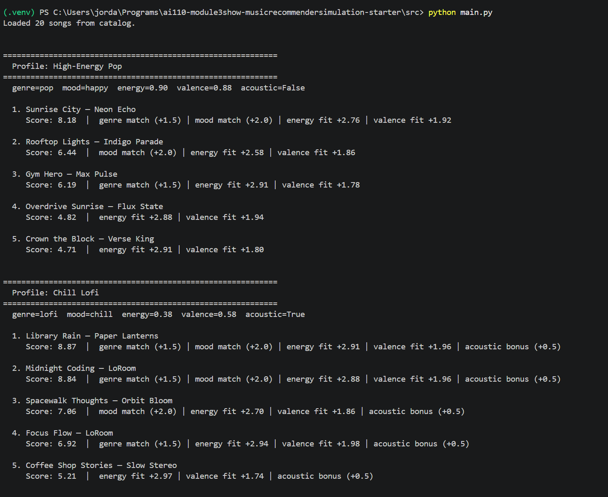
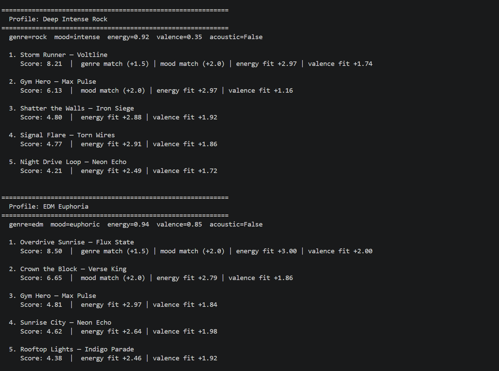
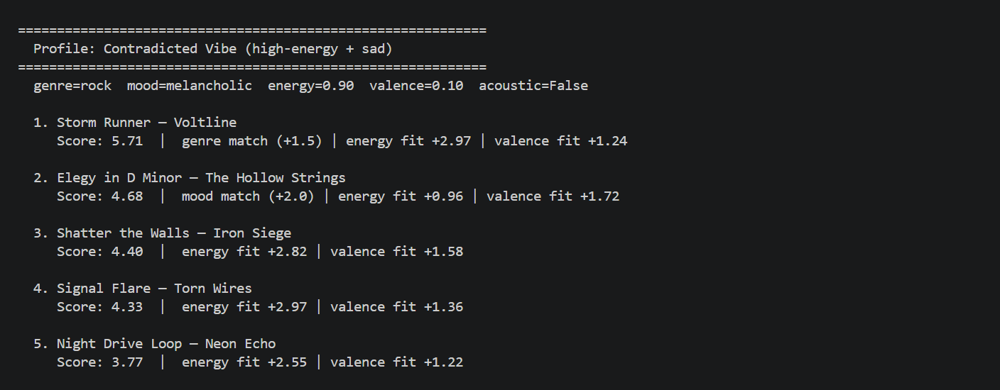

# 🎵 Music Recommender Simulation

## Project Summary

In this project you will build and explain a small music recommender system.

Your goal is to:

- Represent songs and a user "taste profile" as data
- Design a scoring rule that turns that data into recommendations
- Evaluate what your system gets right and wrong
- Reflect on how this mirrors real world AI recommenders

Replace this paragraph with your own summary of what your version does.

---

## How The System Works

This system is a simple content-based recommender that suggests songs based on how they feel, not just surface-level info like title or artist. Each `Song` is represented using features that describe its vibe: genre, mood, energy, tempo, valence (emotional brightness), danceability, and acousticness.

The `UserProfile` stores a snapshot of the listener’s preferences — preferred genre and mood, target values for energy and valence, and whether they like acoustic textures. The system assumes the user can describe what they want upfront and uses that as the baseline for every comparison.

The `Recommender` loops through every song in the catalog, scores it against the user profile, then returns the top K highest-scoring results.

At a high level, the flow looks like this:


### Algorithm Recipe

Each song is scored out of a maximum of **9.0 points**:

| Signal | Points | Method |
|---|---|---|
| Genre match | +1.5 | Exact match — tiebreaker, not a trump card |
| Mood match | +2.0 | Exact match — emotional vibe is non-negotiable |
| Energy closeness | 0 – 3.0 | `3.0 × (1 − \|song.energy − target\|)` — rewards proximity, not just high or low |
| Valence closeness | 0 – 2.0 | `2.0 × (1 − \|song.valence − target\|)` — aligns brightness/happiness tone |
| Acoustic bonus | +0.5 | Awarded when `likes_acoustic = True` and `song.acousticness > 0.6` |

Mood, energy, and valence together account for **7.0 of 9.0 points (78%)**, making how a song *feels* the dominant signal. Genre is worth only 1.5 points — enough to be a meaningful tiebreaker, but not enough to override a strong feel-based match from a different genre. The acoustic bonus is a small texture tiebreaker.

> **Why these weights changed:** The original genre weight of +3.0 caused a single genre label to override mood, energy, and valence combined. For example, a high-energy rock song ranked #1 for a user who explicitly wanted a *sad* mood, simply because the genre tag matched. Lowering genre to +1.5 and raising energy (2.0 → 3.0) and valence (1.5 → 2.0) makes the scoring reflect the idea that how a song feels should outweigh what category it belongs to.

### Potential Biases

- **Exact-match brittleness.** Genre and mood are still matched as exact strings. "indie pop" and "pop" are treated as completely different, so a user who loves pop may score "Rooftop Lights" lower than it deserves. A fuzzy or hierarchical genre model would fix this.
- **Single-entry genres amplify variance.** The catalog has only one song per genre. When genre is the only differentiator between two similarly-feeling songs, the result is determined by a single data point rather than a pattern.
- **No diversity.** The system always returns the closest matches, which can mean recommending the same artist or sound repeatedly. There is no mechanism to spread results across different styles.
- **User profile is static.** The system has no memory of what the user has already heard or skipped. It scores every song the same way every time.


# CLI Verification

A sample run of the main.py reveals recommendations, their scores, and the reasoning behind those scores:


---

## Multi-Profile Terminal Output

`src/main.py` runs eight user profiles back-to-back — four standard profiles and four adversarial / edge-case profiles. Screenshots below reflect the updated weights (genre +1.5, energy ×3.0, valence ×2.0).

### Profiles 1 & 2 — High-Energy Pop and Chill Lofi



### Profiles 3 & 4 — Deep Intense Rock and EDM Euphoria



### Profile 5 — Contradicted Vibe (adversarial: high energy + sad mood)




---

## Getting Started

### Setup

1. Create a virtual environment (optional but recommended):

   ```bash
   python -m venv .venv
   source .venv/bin/activate      # Mac or Linux
   .venv\Scripts\activate         # Windows

2. Install dependencies

```bash
pip install -r requirements.txt
```

3. Run the app:

```bash
python -m src.main
```

### Running Tests

Run the starter tests with:

```bash
pytest
```

You can add more tests in `tests/test_recommender.py`.

---

## Experiments You Tried

Use this section to document the experiments you ran. For example:

- What happened when you changed the weight on genre from 2.0 to 0.5
- What happened when you added tempo or valence to the score
- How did your system behave for different types of users

---

## Limitations and Risks

Summarize some limitations of your recommender.

Examples:

- It only works on a tiny catalog
- It does not understand lyrics or language
- It might over favor one genre or mood

You will go deeper on this in your model card.

---

## Reflection

The main thing I took away from this is that the weights are the model; changing one number by 1.5 points shifted results across every profile, because there is no data volume to absorb a bad design decision. Bias showed up in less obvious ways too, mostly through what the system silently ignored; a user asking for acoustic rock got no acoustic credit applied and no warning about it, which in a real product would just feel like the feature does not work. See the full breakdown in the [Model Card](model_card.md).

