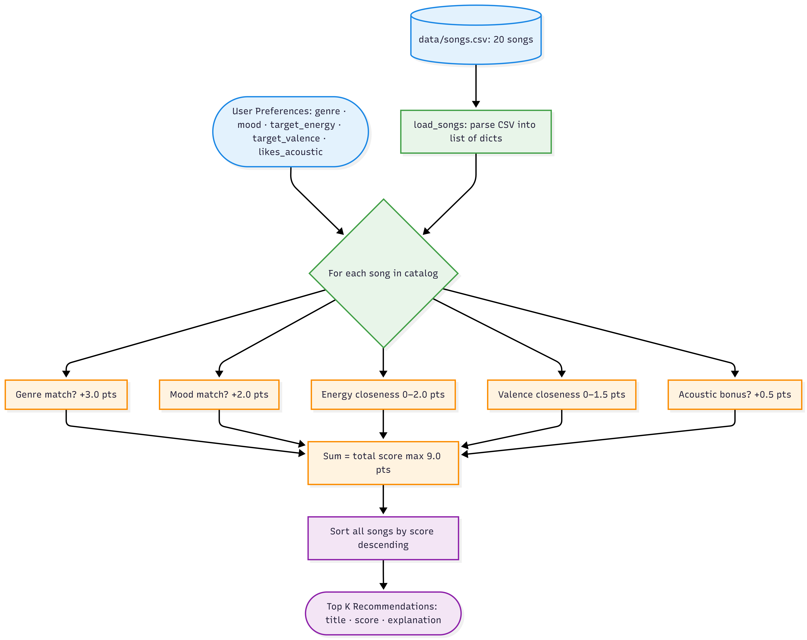
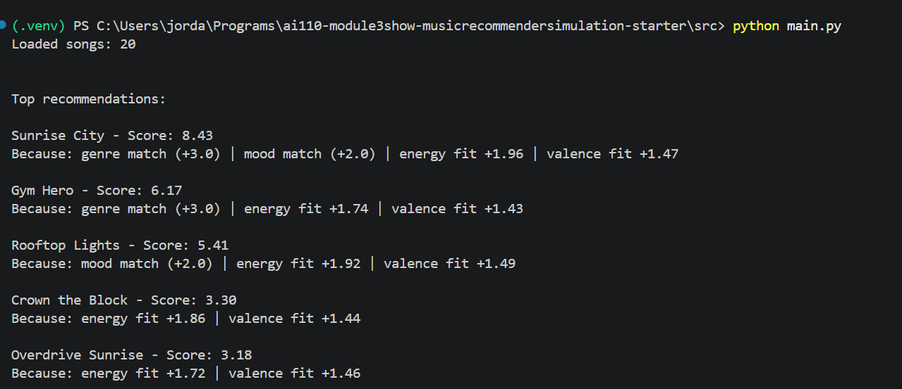

# 🎵 Music Recommender Simulation

## Project Summary

In this project you will build and explain a small music recommender system.

Your goal is to:

- Represent songs and a user "taste profile" as data
- Design a scoring rule that turns that data into recommendations
- Evaluate what your system gets right and wrong
- Reflect on how this mirrors real world AI recommenders

Replace this paragraph with your own summary of what your version does.

---

## How The System Works

This system is a simple content-based recommender that suggests songs based on how they feel, not just surface-level info like title or artist. Each `Song` is represented using features that describe its vibe: genre, mood, energy, tempo, valence (emotional brightness), danceability, and acousticness.

The `UserProfile` stores a snapshot of the listener’s preferences — preferred genre and mood, target values for energy and valence, and whether they like acoustic textures. The system assumes the user can describe what they want upfront and uses that as the baseline for every comparison.

The `Recommender` loops through every song in the catalog, scores it against the user profile, then returns the top K highest-scoring results.

At a high level, the flow looks like this:



### Algorithm Recipe

Each song is scored out of a maximum of **9.0 points**:

| Signal | Points | Method |
|---|---|---|
| Genre match | +3.0 | Exact match — heaviest weight, the core of a listener’s taste |
| Mood match | +2.0 | Exact match — emotional vibe is non-negotiable |
| Energy closeness | 0 – 2.0 | `2.0 × (1 − \|song.energy − target\|)` — rewards proximity, not just high or low |
| Valence closeness | 0 – 1.5 | `1.5 × (1 − \|song.valence − target\|)` — aligns brightness/happiness tone |
| Acoustic bonus | +0.5 | Awarded when `likes_acoustic = True` and `song.acousticness > 0.6` |

Genre and mood together account for **5.0 of 9.0 points (56%)**, making them the dominant signals. Energy and valence add up to **3.5 points** of continuous similarity, so a song that nearly matches on feel but misses the genre label can still rank competitively. The acoustic bonus is a small tiebreaker for texture preference.

### Potential Biases

- **Genre dominance.** Because genre is worth 3.0 points on its own, a song in the wrong genre but with a perfect mood, energy, and valence fit will almost always lose to a same-genre song with mediocre feel. A great folk song will never surface for a pop user, even if the vibe is identical.
- **Exact-match brittleness.** Genre and mood are matched as exact strings. "indie pop" and "pop" are treated as completely different, so a user who loves pop may never see "Rooftop Lights" ranked as high as it deserves.
- **No diversity.** The system always returns the closest matches, which can mean recommending the same artist or sound repeatedly. There is no mechanism to spread results across different styles.
- **User profile is static.** The system has no memory of what the user has already heard or skipped. It scores every song the same way every time.


# CLI Verification

A sample run of the main.py reveals recommendations, their scores, and the reasoning behind those scores:




---

## Getting Started

### Setup

1. Create a virtual environment (optional but recommended):

   ```bash
   python -m venv .venv
   source .venv/bin/activate      # Mac or Linux
   .venv\Scripts\activate         # Windows

2. Install dependencies

```bash
pip install -r requirements.txt
```

3. Run the app:

```bash
python -m src.main
```

### Running Tests

Run the starter tests with:

```bash
pytest
```

You can add more tests in `tests/test_recommender.py`.

---

## Experiments You Tried

Use this section to document the experiments you ran. For example:

- What happened when you changed the weight on genre from 2.0 to 0.5
- What happened when you added tempo or valence to the score
- How did your system behave for different types of users

---

## Limitations and Risks

Summarize some limitations of your recommender.

Examples:

- It only works on a tiny catalog
- It does not understand lyrics or language
- It might over favor one genre or mood

You will go deeper on this in your model card.

---

## Reflection

Read and complete `model_card.md`:

[**Model Card**](model_card.md)

Write 1 to 2 paragraphs here about what you learned:

- about how recommenders turn data into predictions
- about where bias or unfairness could show up in systems like this


---

## 7. `model_card_template.md`

Combines reflection and model card framing from the Module 3 guidance. :contentReference[oaicite:2]{index=2}  

```markdown
# 🎧 Model Card - Music Recommender Simulation

## 1. Model Name

Give your recommender a name, for example:

> VibeFinder 1.0

---

## 2. Intended Use

- What is this system trying to do
- Who is it for

Example:

> This model suggests 3 to 5 songs from a small catalog based on a user's preferred genre, mood, and energy level. It is for classroom exploration only, not for real users.

---

## 3. How It Works (Short Explanation)

Describe your scoring logic in plain language.

- What features of each song does it consider
- What information about the user does it use
- How does it turn those into a number

Try to avoid code in this section, treat it like an explanation to a non programmer.

---

## 4. Data

Describe your dataset.

- How many songs are in `data/songs.csv`
- Did you add or remove any songs
- What kinds of genres or moods are represented
- Whose taste does this data mostly reflect

---

## 5. Strengths

Where does your recommender work well

You can think about:
- Situations where the top results "felt right"
- Particular user profiles it served well
- Simplicity or transparency benefits

---

## 6. Limitations and Bias

Where does your recommender struggle

Some prompts:
- Does it ignore some genres or moods
- Does it treat all users as if they have the same taste shape
- Is it biased toward high energy or one genre by default
- How could this be unfair if used in a real product

---

## 7. Evaluation

How did you check your system

Examples:
- You tried multiple user profiles and wrote down whether the results matched your expectations
- You compared your simulation to what a real app like Spotify or YouTube tends to recommend
- You wrote tests for your scoring logic

You do not need a numeric metric, but if you used one, explain what it measures.

---

## 8. Future Work

If you had more time, how would you improve this recommender

Examples:

- Add support for multiple users and "group vibe" recommendations
- Balance diversity of songs instead of always picking the closest match
- Use more features, like tempo ranges or lyric themes

---

## 9. Personal Reflection

A few sentences about what you learned:

- What surprised you about how your system behaved
- How did building this change how you think about real music recommenders
- Where do you think human judgment still matters, even if the model seems "smart"

